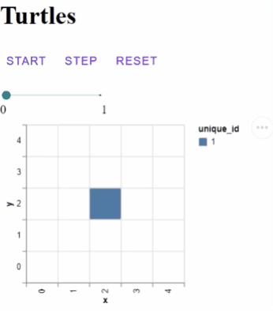
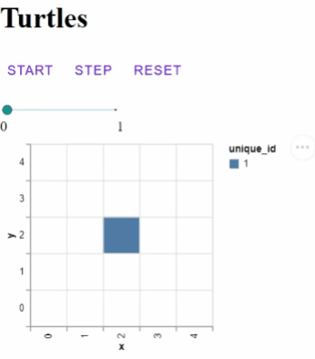
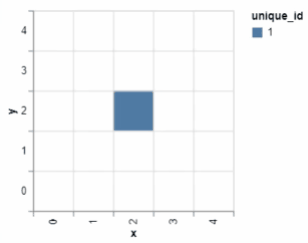
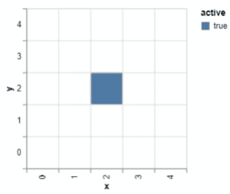

# mesa-viz: A Vega(-lite) based visualization server for Mesa

**warning:** This is currently a pre-release version, use with caution.

## Motivation

This package provides an alternative visualization server for ABMs created with Mesa. The goal is to produce simple charts as easy as possible, while allowing full customization and providing two-way interactions between models and their visualizations.

## Installation and use

This package uses flit for developing and publishing. To install a development version:

```bash
  pip install flit
  git clone https://github.com/corvince/mesa_viz
  cd mesa_viz
  flit install -s
```

## Tutorial

Lets create a simple Turtle-Model, where a single agent moves around. It will look like this:



We start with our a basic Turtle model (if you want to follow along just copy everything inside `turtle.py`):

```python
from mesa import Agent, Model
from mesa.space import SingleGrid
from mesa.time import BaseScheduler

class Turtle(Agent):
    """A moveable turtle."""
    def move(self, direction):
        x, y = self.pos
        dx, dy = direction
        try:
            self.model.grid.move_agent(self, (x + dx, y + dy))
        except:
            return


class TurtleModel(Model):
    def __init__(self, width=5, height=5):
        super().__init__()
        self.active_agent = Turtle(self.next_id(), self)
        self.active_agent.active = True

        self.grid = SingleGrid(width, height, True)
        self.grid.position_agent(self.active_agent, width // 2, height // 2)

        self.schedule = BaseScheduler(self)
        self.schedule.add(self.active_agent)

    def step(self):
        direction = self.random.choice([(1, 0), (-1, 0), (0, 1), (0, -1)])
        self.active_agent.move(direction)
```

At each step our turtle should move in a random direction.

With mesa_viz we can create a grid chart with a single command:

```python
from mesa_viz.VegaSpec import GridChart

grid = GridChart()
```

`GridChart()` automagically creates a Vega-lite specification for our model that we will soon pass to the VegaServer.

To see the specifications we could call `grid_spec.create_spec(TurtleModel())` directly with a model instance, which yields the following JSON-specification:

```json
{
  "$schema": "https://vega.github.io/schema/vega-lite/v4.8.1.json",
  "height": 200,
  "width": 200,
  "data": { "name": "agents" },
  "mark": "rect",
  "encoding": {
    "x": {
      "field": "x",
      "scale": { "domain": [0, 1, 2, 3, 4] },
      "type": "nominal"
    },
    "y": {
      "field": "y",
      "scale": { "domain": [4, 3, 2, 1, 0] },
      "type": "nominal"
    },
    "color": { "field": "active", "type": "nominal" }
  },
  "config": {
    "axis": { "grid": true, "tickBand": "extent" }
  }
}
```

Normally this is done automatically when we start the visualization server like the regular mesa visualization server

```python
from mesa_viz.VegaVisualization import VegaServer

server = VegaServer(TurtleModel, [grid], "Turtles", {}, 1)
server.launch()
```

and launch from the command line with `python turtle.py`. Now we can click on the step button to advance our model. Bonus points: After several steps we can drag around our step slider to go back and forth in time.


So far the grid specifications have been easier than with the normal mesa visualization server, but this is nothing out of the ordinary. Now we try something more fancy. With Mesa_viz we can select our grid chart by clicking on it and then any key presses are forwarded to our model. Lets try that and control our turtle with the directional keys!

We just need to add an `on_key` method to our model:

```python
    def on_key(self, key):
        key_to_direction = {
            "ArrowUp": (0, 1),
            "ArrowDown": (0, -1),
            "ArrowLeft": (-1, 0),
            "ArrowRight": (1, 0),
        }

        direction = key_to_direction.get(key, "")
        if direction:
            self.active_agent.move(direction)
```



Now lets leave a trail behind our turtle by spawning new, inactive turtles. We append to our move function:

```diff
    def move(self, direction):
        x, y = self.pos
        dx, dy = direction
        try:
            self.model.grid.move_agent(self, (x + dx, y + dy))
        except:
            return
+       self.spawn(x, y)
```

and add a new spawn method:

```python
    def spawn(self, x, y):
        trail = Turtle(self.model.next_id(), self.model)
        trail.active = False
        self.model.schedule.add(trail)
        self.model.grid.position_agent(trail, x, y)
```

This gets pretty colorful:



By default `GridChart()` defaults to the `unique_id` attribute for the color. Lets change this now to our `active` attribute:

```python
grid = GridChart(color="active")
```

Finally lets make the active agent selectable by mouse clicks. We just implement an `on_click` method in our model:

```python
    def on_click(self, **kwargs):
        self.active_agent.active = False
        unique_id = kwargs.get("unique_id")
        for agent in self.schedule.agents:
            if agent.unique_id == unique_id:
                self.active_agent = agent
                self.active_agent.active = True
```



Just for demonstrational purpose lets create a multiple model runs side by side. We just need to adjust our call to `VegaServer`

```diff
- server = VegaServer(TurtleDraw, [grid_spec], "TurtleDraw", {})
+ server = VegaServer(TurtleDraw, [grid_spec], "TurtleDraw", {}, n_simulations=3)
server.launch()
```


